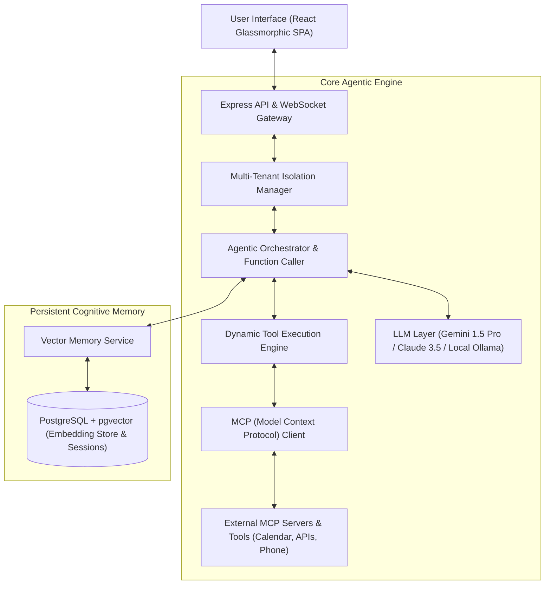

# 🧠 Tera — Autonomous Agentic AI Companion & MCP Assistant

[](https://nodejs.org/)
[](https://reactjs.org/)
[](https://www.postgresql.org/)
[-purple.svg)](https://modelcontextprotocol.io/)
[](https://langchain.com)
[](https://opensource.org/licenses/MIT)

**Tera** is a next-generation autonomous AI Companion and intelligent personal assistant built on **Agentic AI principles, Anthropic's Model Context Protocol (MCP), PostgreSQL with `pgvector` semantic long-term memory, and modern React glassmorphism UI**. Tera integrates multi-modal voice capabilities, autonomous tool execution, and dynamic context retrieval to deliver proactive human-AI collaboration.

---

## 🏛️ System Architecture



---

## ✨ Cutting-Edge Architectural Highlights

1. **🤖 Autonomous Agent Tool Execution:** Implements bidirectional tool execution where the LLM dynamically decides which MCP tools (e.g. Calendar booking, telephony, web scraping, task scheduling) to trigger based on conversation intent.
2. **🔌 Native Model Context Protocol (MCP) Support:** Integrates Anthropic's open MCP standard (`config/mcpClient.js`), allowing Tera to connect seamlessly with standardized tool servers over stdio and SSE transports.
3. **🧠 Long-Term Semantic Vector Memory (`pgvector`):** Uses vector embeddings stored in PostgreSQL via the `pgvector` extension (`config/vectorMemory.js`), enabling conversational RAG with episodic memory recall across sessions.
4. **🏢 Multi-Tenant Security & RBAC:** Complete data isolation per user/tenant with role-based tool execution permissions and security policy managers.
5. **🎨 Glassmorphic Responsive Interface:** Futuristic dark-mode glassmorphic design system featuring animated ambient particle spheres, dynamic audio visualizers, and interactive session timelines.

---

## 📸 Interface Showcase

Tera features a collection of user-centered conversational experiences:

| Conversational Glassmorphism | Voice Companion Mode | Session History & Untangling |
| :---: | :---: | :---: |
| Clean, ambient translucent messaging with markdown and code rendering | Real-time audio waveform visualizer and hands-free conversational flow | Hierarchical session categorization and emotional sentiment tracking |

*(All interface templates and production assets are located in `frontend/public/screens/`)*

---

## 🗄️ Database & Vector Entity Schema

| Table / Entity | Backend Model | Description |
| :--- | :--- | :--- |
| **Users** | `backend/models/user.js` | User identities, tenant IDs, preferences, security tokens |
| **Sessions** | `backend/models/session.js` | Persistent conversation threads, topic categorizations |
| **Messages** | `backend/models/message.js` | Role messages (`user`, `assistant`, `tool`), token counts |
| **Vector Memory** | `backend/config/vectorMemory.js` | High-dimensional embedding vectors with cosine distance indexing |
| **Connections** | `backend/models/connection.js` | OAuth and API tokens for connected MCP services and integrations |
| **Calendar Events** | `backend/models/calendarEvent.js` | Autonomous calendar scheduling and meeting orchestration |

---

## 🚀 Quickstart Guide

### Prerequisites
- **Node.js**: `v18.x` or higher
- **PostgreSQL**: `v15+` with `pgvector` extension installed
- **API Keys**: Gemini or OpenAI API key

### 1. Backend Installation
```bash
cd backend
npm install
cp .env.example .env
# Edit .env with your PostgreSQL credentials & Gemini API key
```

Initialize the database schema:
```bash
node createDb.js
```

Verify `pgvector` extension readiness:
```bash
node check_pgvector.js
```

Start the Backend Server:
```bash
npm start
# Server boots on http://localhost:5000
```

### 2. Frontend Installation
```bash
cd ../frontend
npm install
npm run dev
# Vite server starts on http://localhost:5173
```

---

## 🧪 Testing Agent Function Calling & Tools

Tera includes dedicated testing harnesses for verification:
```bash
cd backend
# Test Gemini LLM integration
node testGeminiCall.js

# Test Autonomous Agent Function Calling
node test_agent_function_calling.js

# Test Mock Stdio MCP Server
node mock_stdio_server.js
```

---

## 👩‍💻 Author & Maintainer

**Vaishnavi Karil**  
*Senior Full Stack MERN & AI Systems Engineer | Pune, India / Open to Germany Relocation*  
- 💼 LinkedIn: [Vaishnavi Karil](https://www.linkedin.com/in/vaishnavi-karil/)  
- 💻 GitHub: [@Vaishnavi-Karil](https://github.com/Vaishnavi-Karil)  
- 📧 Email: [vaishnavigkaril@gmail.com](mailto:vaishnavigkaril@gmail.com)
